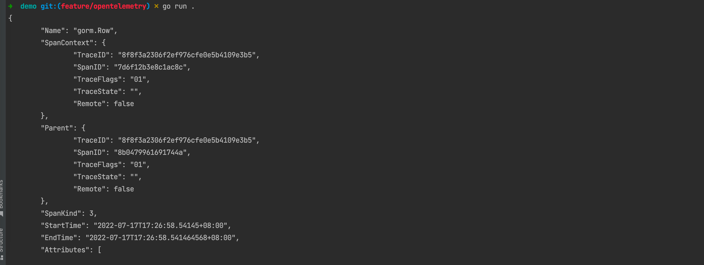
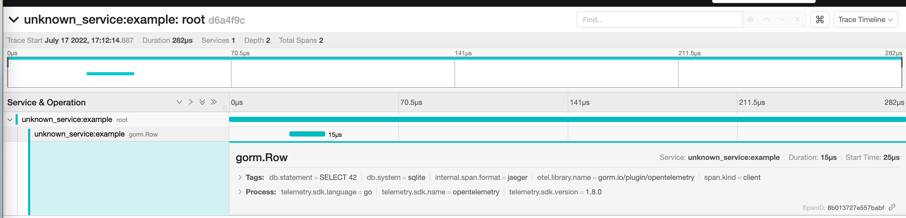

Stdout exporter (default):

`go run .`

---
Jaeger exporter:

Docker: `docker-compose up -d`

Run: `OTEL_EXPORTER_JAEGER_ENDPOINT=http://localhost:14268/api/traces go run .`

View Trace
You can then navigate to http://localhost:16686 to access the Jaeger UI.

        