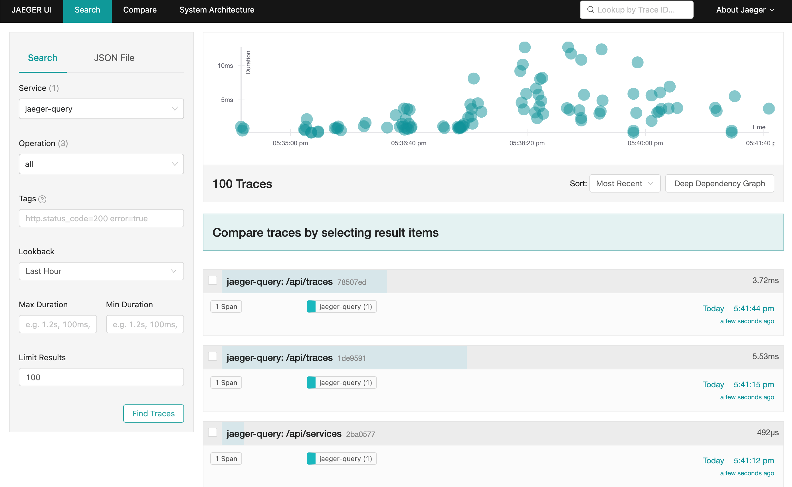

# Tracing example

## Case 1: Stdout exporter (default):

#### 1. Run demo

```shell 
cd examples/demo
go run main.go
```

#### Screenshots


---

## Case 2: Jaeger exporter:

#### 1.Setup Basic Dependence

```shell 
docker-compose up -d
```

#### 2. Set environment variables

```shell 
export OTEL_EXPORTER_JAEGER_ENDPOINT=http://localhost:14268/api/traces
```

#### 3. Run demo

```shell 
cd examples/demo
go run main.go
```

### View Trace

You can then navigate to http://localhost:16686 to access the Jaeger UI.

#### Screenshots



